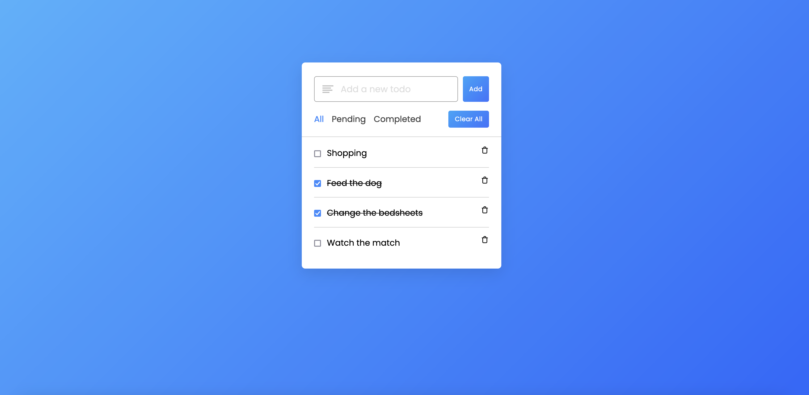

# Rust fullstack todolist



This repository gives a complete todolist stack from the server side to the client side all built in Rust.
The backend is interconnected with a MongoDB database.

## Summary

- [Rust fullstack todolist](#rust-fullstack-todolist)
  - [Summary](#summary)
  - [Prerequisites](#prerequisites)
  - [Clone and set variables](#clone-and-set-variables)
  - [Installation](#installation)

## Prerequisites

Please install or have installed the following:

- [git](https://git-scm.com/book/en/v2/Getting-Started-Installing-Git)
- [trunk](https://trunkrs.dev/#install)

## Clone and set variables

1. Clone this repository

```
git clone https://github.com/jrmunchkin/rust-fullstack-todolist
```

2. Rename .env.example in .env

3. Set variables

Set the `PORT` where you will run your backend (e.g 8000)

Set the `MONGO_URL` to link the database.

Set the `DB_NAME` with the name of your database.

Set the `API_URL` with the url where your backend will run (e.g http://localhost:8000)

## Installation

1. Run the backend

```
cd backend
cargo run
```

2. Run the frontend

```
cd frontend
trunk serve --open
```

3. Enjoy your todolist!
